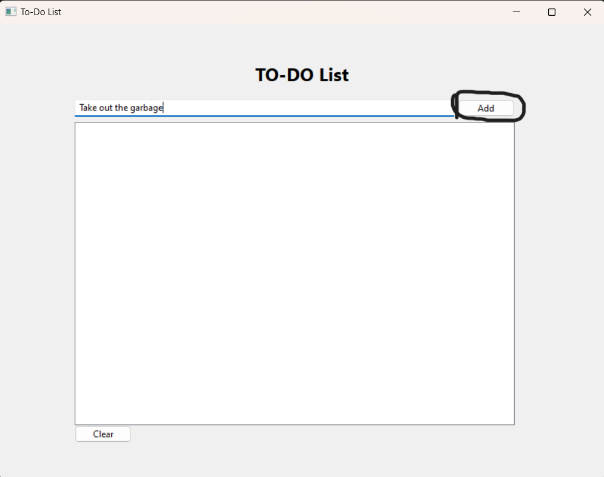
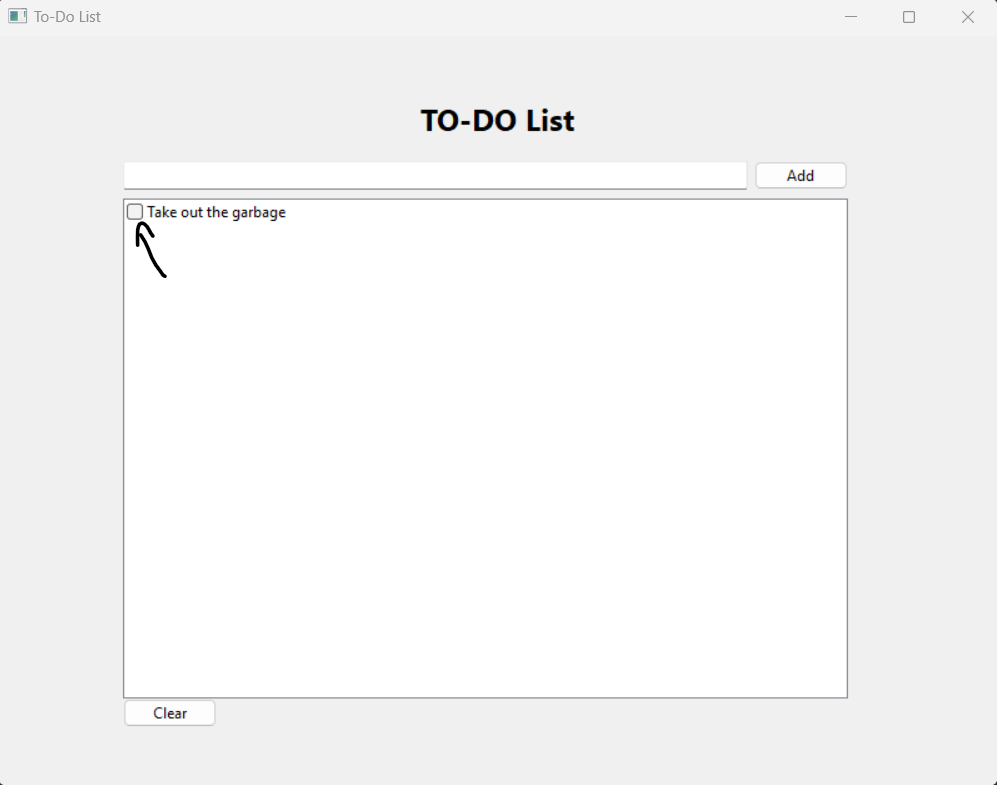
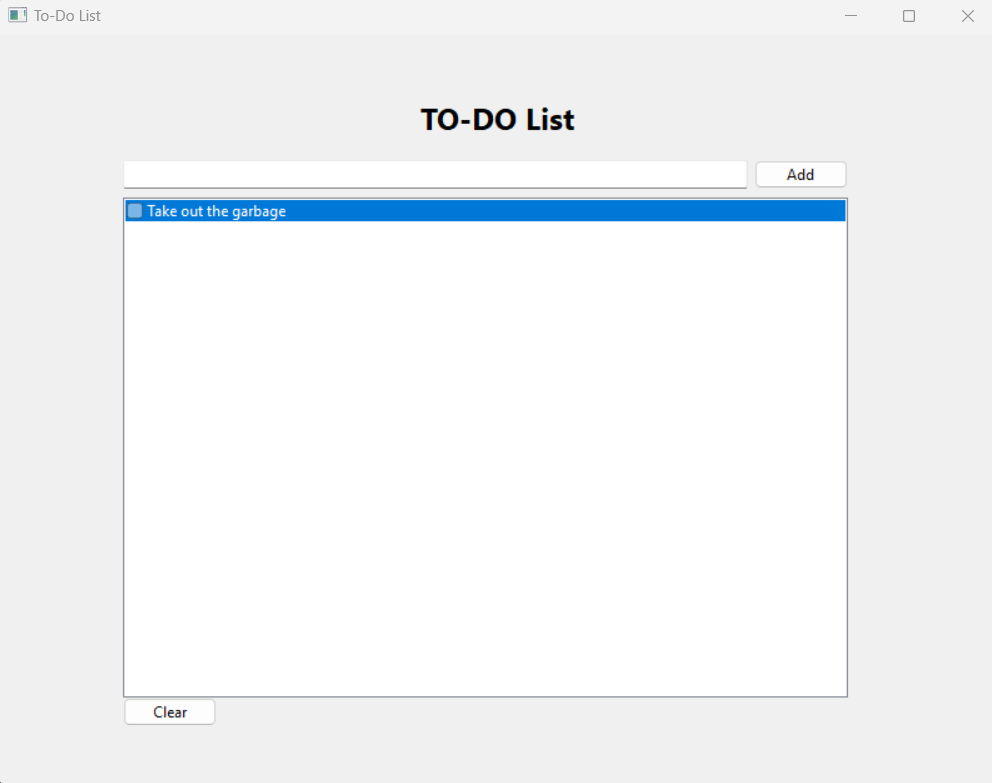

# Instructions

To use this checklist app, just run the checklist.exe file.

This project is based off of this [video](https://www.youtube.com/watch?v=MPLfOoRUKMU) although I modified the
code that was shown to suit my purposes.

# Features

### Add to the checklist

Type something and click the button or press the enter button

### Check an item
Click the little box

### Delete an item
click the item you want to delete

next press the "delete" key on your keyboard and the item will be removed

All items in the checklist are saved upon exit so there's no worry of data loss. 
In the future I plan on adding a feature to load and save to specific files but
that's for when I have free time.